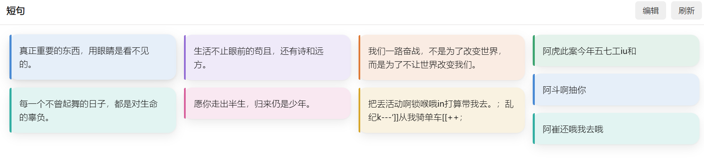
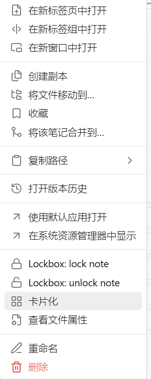
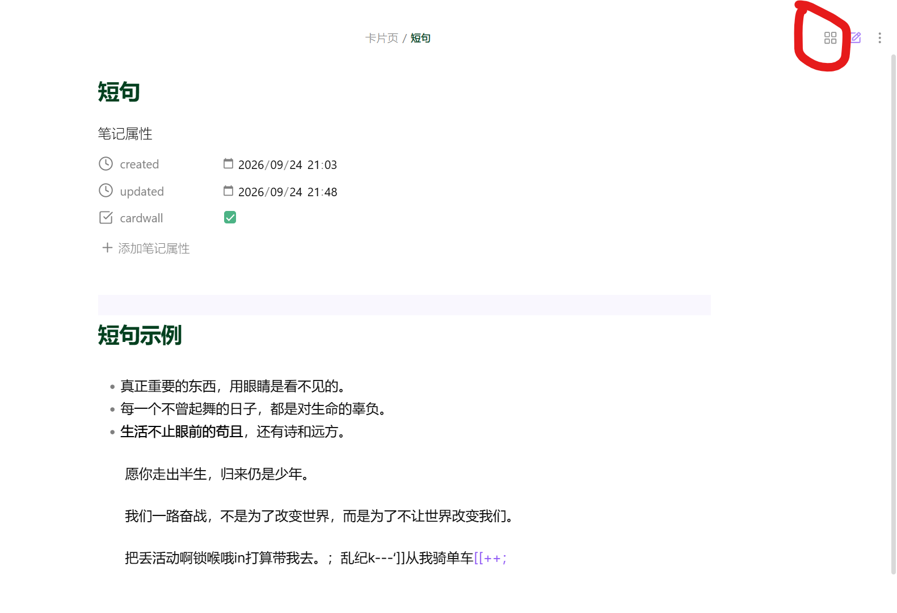
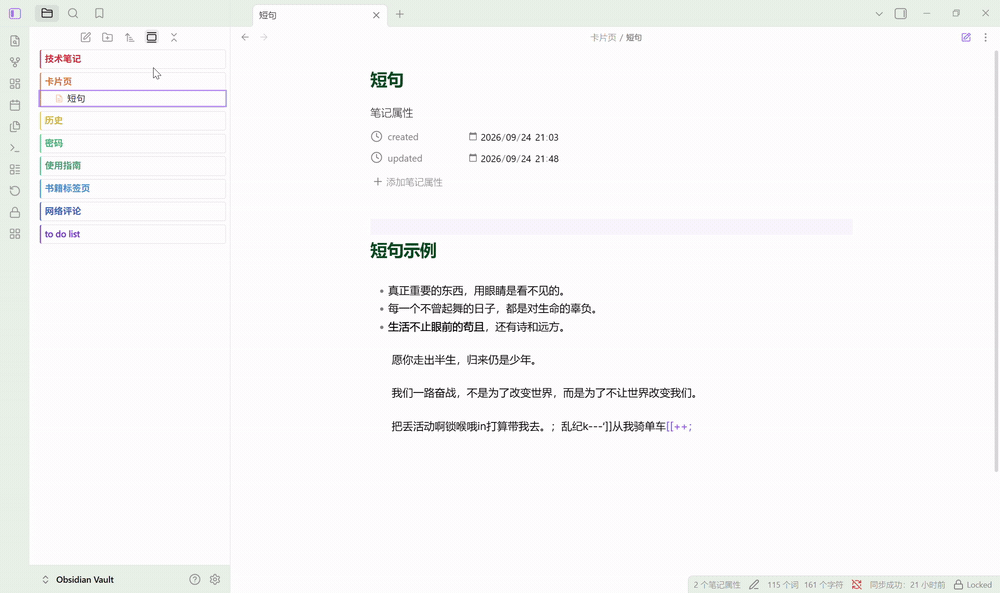

# Short Phrase Cards

把笔记按行拆成短句，以纯 CSS 瀑布流「卡片墙」展示的 Obsidian 插件。









## 功能特性

- **按行拆分**：把笔记正文拆成一条条短句。智能模式会忽略 frontmatter、代码块、空行、标题与分隔线。
- **去 Markdown 标记**：卡片只显示纯文字（列表符号、加粗、链接等自动去掉）。
- **瀑布流卡片墙**：纯 CSS 多列布局，自动适配窗口宽度。
- **卡片外观可自定义**：风格（纸卡/经典/便利贴）、配色（每卡循环色/强调色/灰阶）、着色强度、圆角、阴影、色条与入场动画均可调。
- **右键卡片化**：在文件管理器右键任意 `.md` → 「卡片化」，写入 frontmatter（默认 `cardwall: true`），标记随文件记忆。
- **自动进入卡片模式**：打开带标记的笔记时自动切换为卡片墙。
- **源码 ↔ 卡片切换**：卡片墙工具栏「编辑」回到源码；源码视图标题栏右上角的卡片图标一键回到卡片墙。

## 安装

### 手动安装

1. 到 [Releases](https://github.com/yunfang1718128/obsidian-short-phrase-cards/releases) 下载 `main.js`、`manifest.json`、`styles.css`。
2. 放进 `<vault>/.obsidian/plugins/short-phrase-cards/`。
3. 打开「设置 → 第三方插件」，启用 **Short Phrase Cards**。

### BRAT

安装 [BRAT](https://github.com/TfTHacker/obsidian42-brat)，添加仓库 `yunfang1718128/obsidian-short-phrase-cards`。

## 使用

1. 在文件管理器右键任意 Markdown 笔记 → 「卡片化」。
2. 打开该笔记，自动显示卡片墙。
3. 点工具栏「编辑」进入源码视图；点标题栏右上角的卡片图标回到卡片墙。
4. 再右键一次选择「取消卡片化」即可移除标记。

命令面板（`Ctrl+P`）也提供：

- **打开当前笔记的卡片墙**
- **切换当前笔记的卡片化标记**

## 设置

| 设置项 | 说明 | 默认值 |
| --- | --- | --- |
| 卡片化标记属性 | 写入 frontmatter 的属性名 | `cardwall` |
| 打开时自动进入卡片模式 | 打开带标记的笔记时自动切换为卡片墙 | 开 |
| 拆分模式 | 智能拆分 / 每个非空行 | 智能拆分 |
| 去掉 Markdown 标记 | 卡片只显示纯文字 | 开 |
| 最短长度 | 过滤掉短于该字符数的短句 | 1 |
| 最长长度 | 过滤掉长于该字符数的短句，0 表示不限制 | 0 |
| 去重 | 相同内容的短句只保留一张卡片 | 关 |
| 卡片最小宽度 | 瀑布流卡片列宽（px） | 240 |
| 卡片字号 | 卡片文字大小（px） | 14 |
| 卡片风格 | 纸卡极简 / 经典方框 / 便利贴 | 纸卡极简 |
| 卡片配色 | 每卡循环色 / 单一强调色 / 主题灰阶 | 每卡循环色 |
| 着色强度 | 卡片底色着色浓度（0–40） | 14 |
| 卡片圆角 | 圆角半径（px） | 14 |
| 卡片阴影 | 无 / 轻 / 中 / 强 | 中 |
| 卡片色条 | 无 / 左侧 / 顶部 | 左侧 |
| 入场动画 | 卡片错落淡入 | 开 |

## 开发

```bash
npm i
npm run dev    # 监听构建，输出到 vault 插件目录
npm run build  # 类型检查 + 生产构建
npm test       # 解析器单元测试
```

构建默认输出到 `C:\Users\lenovo\Documents\Obsidian Vault\.obsidian\plugins\short-phrase-cards`，可用环境变量 `OBSIDIAN_PLUGIN_DIR` 覆盖。

## 已知限制

- 仅桌面端（`isDesktopOnly: true`）。
- 卡片为只读展示，编辑请在源码视图中进行。

## License

[MIT](LICENSE)

---

## English


**Short Phrase Cards** turns each line of a note into a short phrase and displays them as a pure-CSS masonry card wall.

- Split notes into phrases (smart mode ignores frontmatter, code blocks, blank lines, headings and rules).
- Strip Markdown so cards show plain text only.
- Right-click any `.md` file → **Cardify** to store a frontmatter marker (`cardwall: true`).
- Cardified notes open as a card wall automatically.
- Switch between source and cards via the toolbar **Edit** button and the card icon in the tab header.

Install manually from [Releases](https://github.com/yunfang1718128/obsidian-short-phrase-cards/releases), or via BRAT with repo `yunfang1718128/obsidian-short-phrase-cards`.

Desktop only. Licensed under [MIT](LICENSE).
